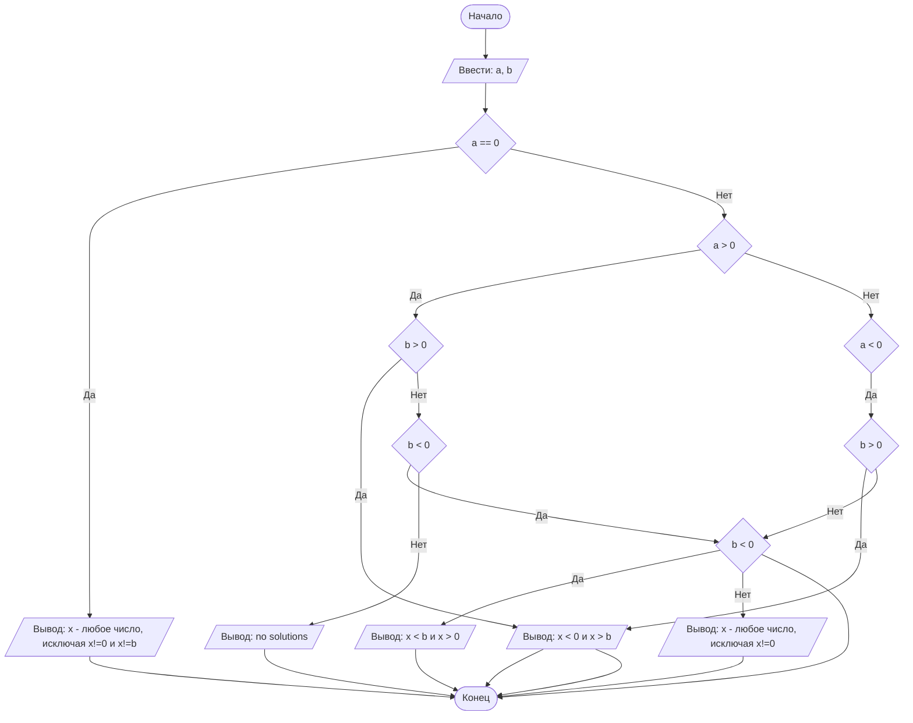

## Отчет по лабораторной работе №  1

#### № группы: ПМ - 2402

#### Выполнил: Коротеева Юлия Андреевна

#### Вариант: `14`

### Cодержание:

- [Постановка задачи](#1-постановка-задачи)
- [Входные и выходные данные](#2-входные-и-выходные-данные)
- [Математическая модель](#25-математическая-модель)
- [Выбор структуры данных](#3-выбор-структуры-данных)
- [Алгоритм](#4-алгоритм)
- [Программа](#5-программа)
- [Анализ правильности решения](#6-анализ-правильности-решения)

### 1. Постановка задачи

Программа получает на вход 2 числа a и b, не пресыщающих по модулю 10<sup>9</sup>. 
Нужно сравнить число a и b относительно нуля и найти интервал на числовой прямой x.

Данную задачу можно разделить на 3 части:
1)Рассмотрим первый случай, когда a=0 и найдем x, учитывая ограничения(1 случай);
2)Рассмотрим случай, когда a>0 и найдем x, учитывая ограничения(3 случая);
3)Рассмотрим случай, когда a<0 и найдем x, учитывая ограничения(3 случая);

Всего надо рассмотреть 3*2+1=7 случаев.

### 2. Входные и выходные данные

Данные на вход

На вход программа должна получать 2 числа, при этом в условии не сказано, к какому множеству 
принадлежат получаемые числа, поэтому будем считать их вещественными. Также даны верхняя и нижняя граница получаемых чисел.

|             | Тип                | min значение    | max значение   |
|-------------|--------------------|-----------------|----------------|
| a (Число 1) | Вещественное число | 10<sup>9</sup>  | 10<sup>9</sup> |
| b (Число 2) | Вещественное число | -10<sup>9</sup> | 10<sup>9</sup> |

Данные на выход

Т.к. программа должна вывести интервал относительно x, то на выход мы получим единственное вещественное число b, 
не превышающее 10<sup>9</sup>

|         | Тип                | min значение | max значение   |
|---------|--------------------|--------------|----------------|
| Число 1 | Вещественное число | 1            | 10<sup>9</sup> |

### 3. Выбор структуры данных

Программа получает 2 вещественных числа, не превышающих по модулю 10<sup>9</sup> < 2<sup>30</sup>. 
Поэтому для их хранения можно выделить 2 переменных (a и b) типа double.

|             | название переменной | Тип (в Java) | 
|-------------|---------------------|--------------|
| a (Число 1) | `a`                 | `double`     |
| b (Число 2) | `b`                 | `double`     | 

### 4. Алгоритм

1. **Ввод данных:**  
   Программа считывает два вещественных числа, обозначенные как `a` и `b`.

2. **Сравнение чисел:**  
   Сначала программа рассматривает случай, когда `a`=0; затем переходит к следующему шагу для работы с `a`, проверяет случай, когда `a`> 0
и перебирает три случая с переменной `b` (b=0, b>0 и b<0); тоже самое программа делает и для случая, когда `a`< 0.

3. **Проверка знака для выбранного числа:**
   Во всех случаях неравенство строгое, так как ограничения находятся в знаменателе. 
По условию дробь должна быть больше или равна нулю, значит если числитель и знаменатель 
положительные или оба отрицательные, то знак остается прежним, соблюдая строгость, если же числитель и знаменатель 
имеют противоположные знаки, то домножаем дробь на минус единицу и меняем знак неравенства на противоположный.

4. **Вывод результата:**  
   На экран выводится интервал значений на числовой прямой x.

```markdown
    ```mermaid
        graph TD
    A([Начало])--> B[/ Ввести: a, b/]
    B --> C{a == 0}
    C -- Да --> E[/Вывод: x - любое число, исключая x!=0 и x!=b/]
    C -- Нет --> D{a > 0}
    D -- Да --> H{b > 0}
    D -- Нет --> I{a < 0}
    H -- Да --> M[/Вывод: 0 < x < b/]
    H -- Нет --> P{b < 0}
    P -- Да --> O[/Вывод: b < x < 0/]
    P -- Нет --> W[/Вывод: no solutions/]
    I -- Да --> R{b > 0}
    R -- Да --> M[/Вывод: x < 0 и x > b/]
    R -- Нет --> O{b < 0}
    O -- Да --> U[/Вывод: x < b и x > 0/]
    O -- Нет --> Q[/Вывод: x - любое число, исключая x!=0/]
    E --> Z
    M --> Z
    O --> Z
    W --> Z
    M --> Z
    U --> Z
    Q --> Z([Конец]) 
```




### 5. Программа

```markdown
import java.io.PrintStream;
import java.util.Scanner;
public class Main {
// Объявляем объект класса Scanner для ввода данных

    public static Scanner in = new Scanner(System.in);
    // Объявляем объект класса PrintStream для вывода данных
    public static PrintStream out = System.out;
    public static void main(String[] args) {
//Cначала преобразуем наше неравенство в вид a/x*b-x**x >=0
//теперь найдем ограничения для знаменателя: x*b-x**x != 0
//тогда получаем, что x!=0 и x!=b

        // Считывание двух вещественных чисел a и b из консоли
        double a = in.nextDouble();
        double b = in.nextDouble();
        // Рассмотрим три случая относительно a
        // Пусть число a сначала равняется 0

        if (a == 0) {
            out.printf("x - любое число, исключая x!=0 и x!=%.1f", b);  // так как число a находится в числители, то дробь точно будет >= 0, значит x является любым числом, за исключением ограничений
        }
        else if (a > 0) { // теперь рассмотрим второй случай, когда a > 0
// для того, чтобы найти интервал на числовой прямой x, нужно рассмотреть 3 случая для числа b
if (b > 0)

                // пусть сначала b>0; подставим положительное a и b в преобразованное неравенство;
// a > 0 (по нашему условию), x*b-x**x >= 0, значит вся дробь больше или равна 0;
// теперь найдем корни, чтобы определить точки на интервале: x*b-x**x = 0 -> x = 0 или x = b,
// так как корни находятся в знаменателе, то получим выколотые точки и строгое неравенство;

                out.printf("0<x<%.1f", b);

                // пусть сначала b<0; подставим положительное a и отрицательное b в преобразованное неравенство;
// a > 0 (по нашему условию), x*b-x**x <= 0, домножаем левую и правую часть на (-1), а знак неравенства меняем на противоположный  значит вся дробь больше или равна 0;
// теперь найдем корни, чтобы определить точки на интервале: x*b-x**x = 0 -> x = 0 или x = b
// так как корни находятся в знаменателе, то получим выколотые точки и строгое неравенство;

            else if (b < 0)
                out.printf("%.1f<x<0", b);

//если b == 0 , то знаменатель x*0 - x**x <= 0,это противоречит исходному неравенству, значит в данном случае корней нет

            else if (b == 0)
                out.println("no solutions");
        }
// теперь рассмотрим третий случай, когда a < 0
// для того, чтобы найти интервал на числовой прямой x, нужно  также рассмотреть 3 случая для числа b

        else if (a < 0) {

            // пусть сначала b>0; подставим отрицательное a и положительное b в преобразованное неравенство;
// a < 0 (по нашему условию), x*b-x**x >= 0;
// так как в числителе находится отрицательное число, которое влияет на знак, то домножаем левую и правую часть на (-1), а знак неравенства меняем на противоположный
// теперь найдем корни, чтобы определить точки на интервале: x*b-x**x = 0 -> x = 0 или x = b,
// так как корни находятся в знаменателе, то получим выколотые точки и строгое неравенство;
if (b > 0)
out.printf("x <  0 и x > %.1f", b);

                // пусть сначала b<0; подставим отрицательные a и b в преобразованное неравенство;
// a < 0 (по нашему условию), x*b-x**x <= 0, числитель и знаменатель отрицательные, тогда вся дробь становится больше или равна 0;
// находим корни, как и в предыдущих случаях;

            else if (b < 0)
                out.printf("x<%.1f и x>0", b);

//если b == 0 , то знаменатель x*0 - x**x <= 0, числитель также отрицательный, тогда вся дробь становится больше или равна 0; значит x является любым числом, за исключением 0.

            else if (b == 0)
                out.printf("x - любое число, исключая x!=0");
        }
    }
}

### 6. Анализ правильности решения

1. Тест на a==0:

- Input:
   0
   9

- Output:
    x - любое число, исключая x!=0 и x!=9,0

2. Тест на a>0:

- Input:
    4
    999

- Output:
    0<x<999,0

- Input:
    3
    -3597

- Output:
    -3597,0<x<0

- Input:
    32187,10212
    0

- Output:
    no solutions

3. Тест на a<0:

- Input:
    -6484
    268,421452

- Output:
    x<0 и x>268,4

- Input:
    -8
    -3,04

- Output:
    x<-3,0 и x>0
    
- Input:
    -36
    0

- Output:
    x - любое число, исключая x!=0
  